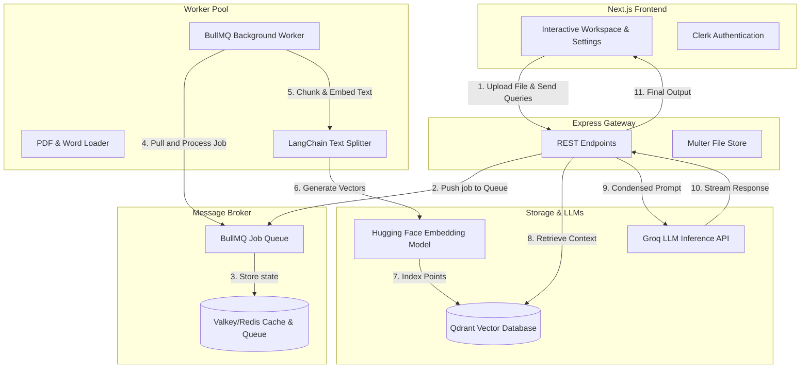

# ResolveAI: High-Performance Isolated RAG Assistant

ResolveAI is a production-grade, containerized Retreival-Augmented Generation (RAG) platform that allows users to securely upload, index, and query context over large collections of PDF and DOCX files. 

Built with a decoupled, asynchronous microservices architecture, ResolveAI handles document parsing and vector generation in a background job worker queue to keep the API server highly responsive and non-blocking under heavy load.

---

## 🏗️ System Architecture

Unlike typical monolithic wrappers, ResolveAI is engineered using a scalable, distributed pattern:



---

## ⚡ Key Technical Highlights

*   **Asynchronous Background Ingestion:** Avoids blocking the main Express event loop. When a user uploads large documents, the API delegates parsing, chunking, and vector embedding to a **BullMQ** worker pool backed by **Valkey/Redis**.
*   **Vector Isolation & Metadata Routing:** Integrates **Qdrant** with granular vector filters. Context retrieval is restricted strictly to the files selected by the user, enforced by their Clerk identity.
*   **History-Aware Conversation Loop:** Implements LangChain-based query condensation. The engine rewrites user prompts relative to previous chat context before querying the vector store, enabling fluid, contextual multi-turn conversations.
*   **Multi-Provider LLM Integration:** Features runtime provider configuration, allowing users to toggle LLM engines (Groq Cloud, Hugging Face, or local engines) and manage model parameters inside a custom settings panel.
*   **Clerk Path Routing Integration:** Custom path-routed authentication flows (`/sign-in` and `/sign-up`) styled with a cohesive, dark-mode user interface.
*   **Full Data Sovereignty (Delete Account):** Includes a cascading deletion API. Deleting an account recursively purges the user's vector embeddings in Qdrant, deletes their files on disk, wipes their database registry, cleanses their chat histories, and deletes their credentials from Clerk.

---

## 🛠️ Technology Stack

*   **Frontend:** Next.js 16 (App Router), Tailwind CSS v4, Lucide Icons, Clerk Auth
*   **Backend:** Node.js, Express, Multer, BullMQ
*   **Databases:** Qdrant (Vector Database), Valkey / Redis (Queue & Caching)
*   **Orchestration:** Docker, Docker Compose
*   **AI Frameworks:** LangChain JS, Hugging Face Inference SDK, Groq SDK

---

## 🚀 Quick Start (Local Development)

### 1. Prerequisites
Ensure you have **Node.js (v20+)**, **pnpm (v9+)**, and **Docker** installed.

### 2. Set Up Environment Variables
Create a `.env` file in both `client` and `server` folders:

**`client/.env`**:
```env
NEXT_PUBLIC_CLERK_PUBLISHABLE_KEY=pk_test_...
CLERK_SECRET_KEY=sk_test_...
NEXT_PUBLIC_CLERK_SIGN_IN_URL=/sign-in
NEXT_PUBLIC_CLERK_SIGN_UP_URL=/sign-up
```

**`server/.env`**:
```env
HUGGINGFACEHUB_API_KEY=hf_...
GROQ_API_KEY=gsk_...
CLERK_SECRET_KEY=sk_test_...
```

### 3. Spin Up Databases
Start Qdrant and Valkey using Docker Compose:
```bash
docker compose up -d
```

### 4. Run the Stack
Start the backend services:
```bash
cd server
pnpm install
pnpm run dev         # Launches Express API on Port 8000
pnpm run dev:worker  # Launches BullMQ worker thread
```

In a new terminal, start the Next.js client:
```bash
cd client
pnpm install
pnpm run dev         # Launches Next.js Client on Port 3000
```

---

## 🐳 Containerized Production Deployment

You can deploy the entire stack—complete with database volume persistence and shared volume folder sharing—using the production compose file:

```bash
docker compose -f docker-compose.prod.yml --env-file .env up -d --build
```

This deploys:
*   **Valkey** (port `6379`) with persistent data volumes.
*   **Qdrant** (port `6333`) with persistent vector storage.
*   **Express API** (port `8000`) and **BullMQ Worker** sharing the uploaded files volume `/app/uploads`.
*   **Next.js Frontend** (port `3000`) built and optimized for production.
