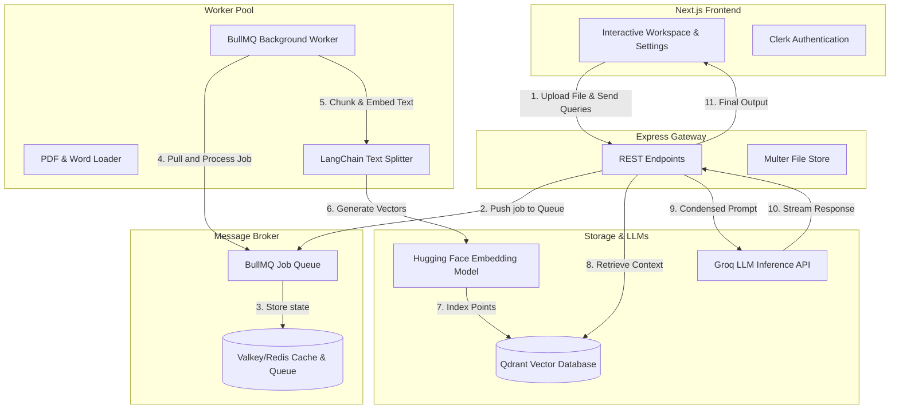

# ResolveAI: High-Performance Isolated RAG Assistant

<p align="center">
  
  
  
  
  
  
  
</p>

<p align="center">
  <b>Cloud Integration Suite:</b> &nbsp;
   &nbsp;
   &nbsp;
   &nbsp;
  
</p>


ResolveAI is a production-grade, containerized Retreival-Augmented Generation (RAG) platform that allows users to securely upload, index, and query context over large collections of PDF and DOCX files. 

Built with a decoupled, asynchronous microservices architecture, ResolveAI handles document parsing and vector generation in a background job worker queue to keep the API server highly responsive and non-blocking under heavy load.

---

## 🏗️ System Architecture

Unlike typical monolithic wrappers, ResolveAI is engineered using a scalable, distributed pattern:



---

## ⚡ Key Technical Highlights

*   **Asynchronous Background Ingestion:** Avoids blocking the main Express event loop. When a user uploads large documents, the API delegates parsing, chunking, and vector embedding to a **BullMQ** worker pool backed by **Valkey/Redis**.
*   **Vector Isolation & Metadata Routing:** Integrates **Qdrant** with granular vector filters. Context retrieval is restricted strictly to the files selected by the user, enforced by their Clerk identity.
*   **History-Aware Conversation Loop:** Implements LangChain-based query condensation. The engine rewrites user prompts relative to previous chat context before querying the vector store, enabling fluid, contextual multi-turn conversations.
*   **Multi-Provider LLM Integration:** Features runtime provider configuration, allowing users to toggle LLM engines (Groq Cloud, Hugging Face, or local engines) and manage model parameters inside a custom settings panel.
*   **Clerk Path Routing Integration:** Custom path-routed authentication flows (`/sign-in` and `/sign-up`) styled with a cohesive, dark-mode user interface.
*   **Full Data Sovereignty (Delete Account):** Includes a cascading deletion API. Deleting an account recursively purges the user's vector embeddings in Qdrant, deletes their files on disk, wipes their database registry, cleanses their chat histories, and deletes their credentials from Clerk.

---

## 🛠️ Technology Stack

*   **Frontend:** Next.js 16 (App Router), Tailwind CSS v4, Lucide Icons, Clerk Auth
*   **Backend:** Node.js, Express, Multer, BullMQ
*   **Databases:** Qdrant (Vector Database), Valkey / Redis (Queue & Caching)
*   **Orchestration:** Docker, Docker Compose
*   **AI Frameworks:** LangChain JS, Hugging Face Inference SDK, Groq SDK

---

## 🚀 Quick Start (Local Development)

### 1. Prerequisites
Ensure you have **Node.js (v20+)**, **pnpm (v9+)**, and **Docker** installed.

### 2. Set Up Environment Variables
Create a `.env` file in both `client` and `server` folders:

**`client/.env`**:
```env
NEXT_PUBLIC_CLERK_PUBLISHABLE_KEY=pk_test_...
CLERK_SECRET_KEY=sk_test_...
NEXT_PUBLIC_CLERK_SIGN_IN_URL=/sign-in
NEXT_PUBLIC_CLERK_SIGN_UP_URL=/sign-up
```

**`server/.env`**:
```env
HUGGINGFACEHUB_API_KEY=hf_...
GROQ_API_KEY=gsk_...
CLERK_SECRET_KEY=sk_test_...
```

### 3. Spin Up Databases
Start Qdrant and Valkey using Docker Compose:
```bash
docker compose up -d
```

### 4. Run the Stack
Start the backend services:
```bash
cd server
pnpm install
pnpm run dev         # Launches Express API on Port 8000
pnpm run dev:worker  # Launches BullMQ worker thread
```

In a new terminal, start the Next.js client:
```bash
cd client
pnpm install
pnpm run dev         # Launches Next.js Client on Port 3000
```

---

## 🚢 Production Deployment

You can deploy the complete stack using two different production architectures:

### Strategy A: Always-Free Cloud Services (24/7, No Cold Starts - Recommended)
This strategy deploys all components using free tiers that **stay awake 24/7** and do not sleep.

#### 1. Databases (Vector & Caching Queue)
*   **Vector DB (Qdrant Cloud):** Create a free cluster on [Qdrant Cloud](https://cloud.qdrant.io/) (1 GB free RAM, ~25,000 vectors). Obtain the **Cluster URL** and **API Key**.
*   **Queue Cache (Upstash Redis):** Create a serverless database on [Upstash](https://upstash.com/). Obtain the **Redis Host**, **Port (`6379`)**, and **Password**.

#### 2. Backend API & Queue Worker (Hugging Face Spaces)
Hugging Face Spaces offers **Docker-based hosting** with **16 GB RAM & 2 vCPUs** on their free tier, running 24/7 without sleeping:
1.  Create a **New Space** on Hugging Face, select **Docker** as the SDK, and choose the **Blank** template.
2.  In the Space **Settings**, go to **Variables and secrets** and add:
    *   **Variables:** `REDIS_HOST`, `REDIS_PORT` (`6379`)
    *   **Secrets:** `REDIS_PASSWORD`, `QDRANT_URL`, `QDRANT_API_KEY`, `HUGGINGFACEHUB_API_KEY`, `GROQ_API_KEY`, `CLERK_SECRET_KEY`
3.  Connect/push your repository. Hugging Face will compile our optimized unified [`server/Dockerfile`](file:///d:/Projects/AI/pdf-rag/server/Dockerfile) and spin up both the Express API and the background worker concurrently.
4.  Your backend URL will be: `https://<your-username>-<your-space-name>.hf.space`

#### 3. Frontend Next.js Client (Vercel)
1.  Import your repository to [Vercel](https://vercel.com/) and set the **Root Directory** to `client`.
2.  Add these **Environment Variables**:
    *   `NEXT_PUBLIC_API_URL`: (Your backend Hugging Face Space URL)
    *   `NEXT_PUBLIC_CLERK_PUBLISHABLE_KEY`: (Your Clerk key)
    *   `NEXT_PUBLIC_CLERK_SIGN_IN_URL`: `/sign-in`
    *   `NEXT_PUBLIC_CLERK_SIGN_UP_URL`: `/sign-up`
3.  Click **Deploy**.

---

### Strategy B: Single-Server Docker Compose
Ideal for self-hosting on a virtual machine (such as Oracle Cloud Always Free 24GB RAM Instance, AWS EC2, or DigitalOcean):

1.  Create a production `.env` file at the root folder containing your Clerk, Hugging Face, and Groq API keys.
2.  Deploy the entire stack with one command:
    ```bash
    docker compose -f docker-compose.prod.yml --env-file .env up -d --build
    ```
    This automatically spins up and links:
    *   **Valkey** (port `6379`) & **Qdrant** (port `6333`) with persistent data volumes.
    *   **Express API** (port `8000`) & **BullMQ Worker** sharing the uploads directory.
    *   **Next.js Client** (port `3000`) optimized for production.
